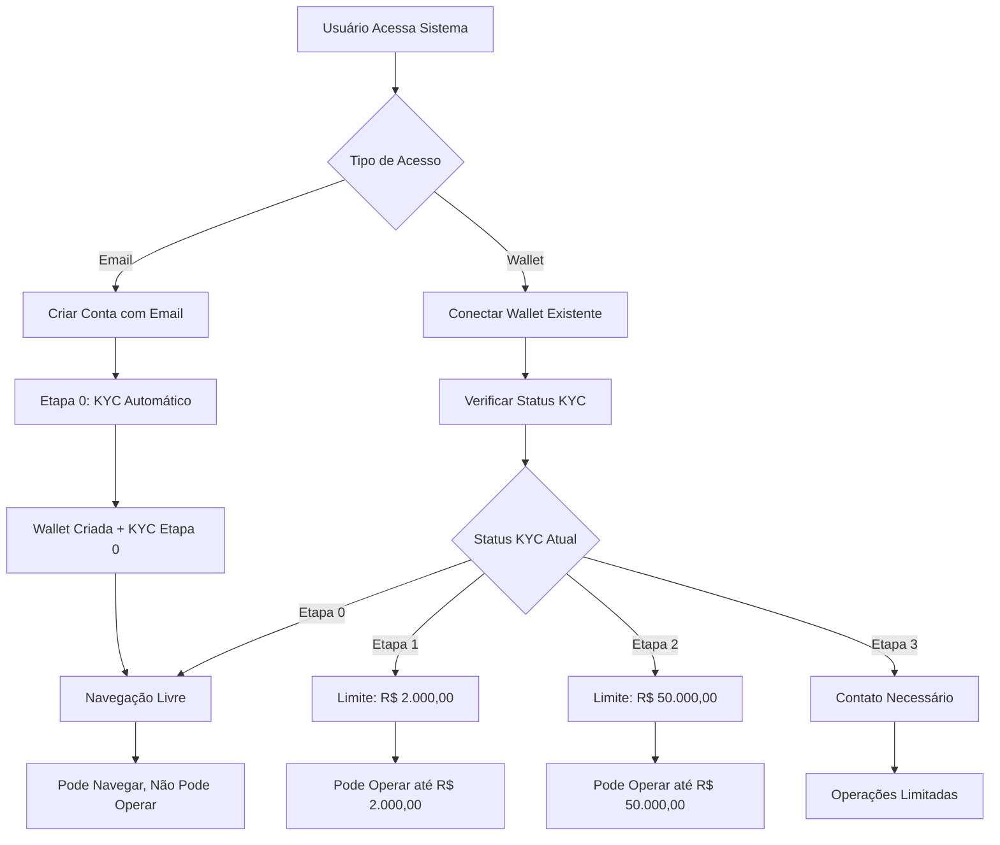
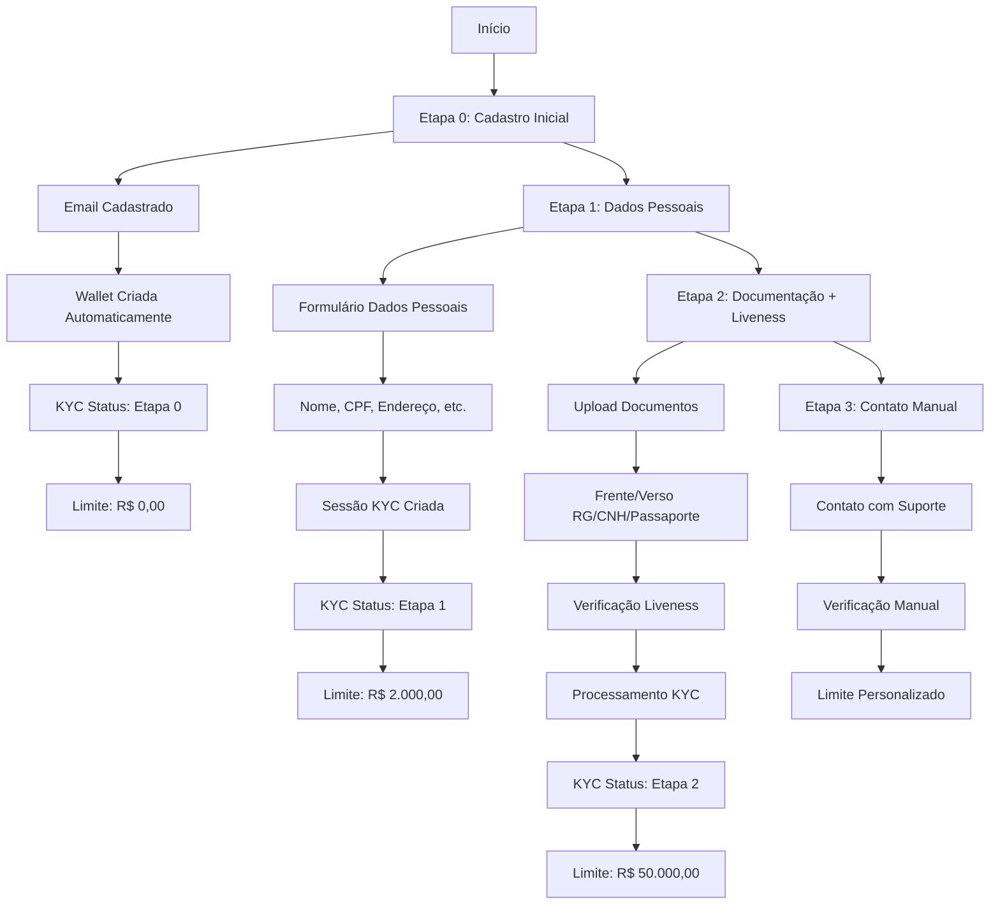
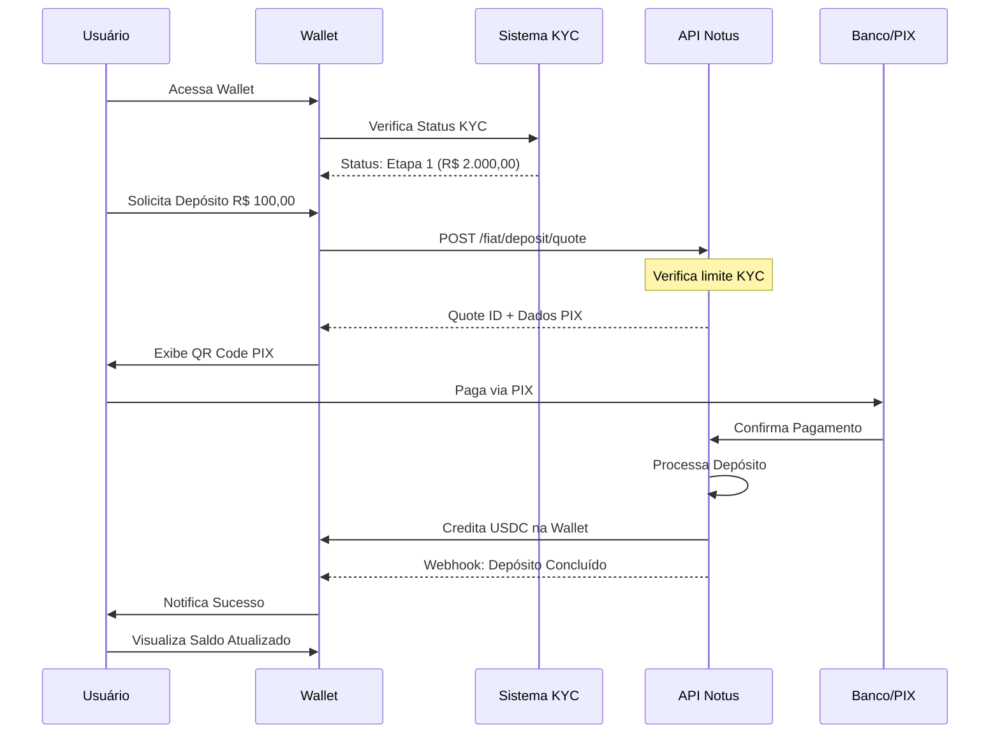
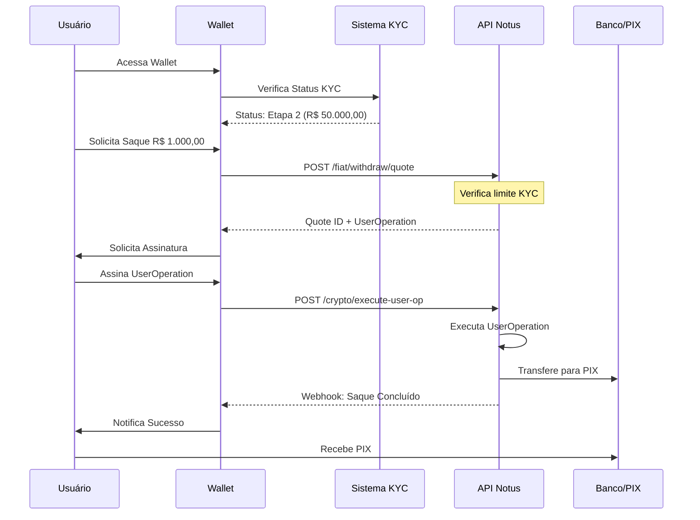
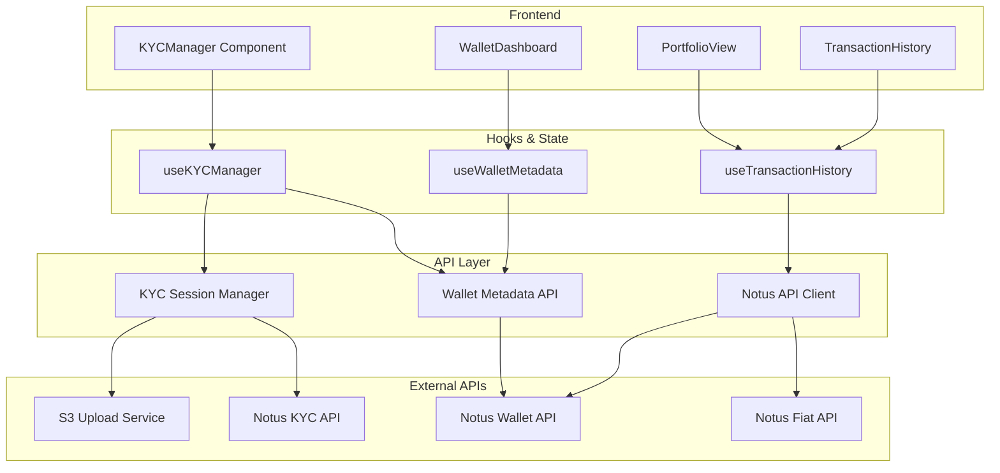
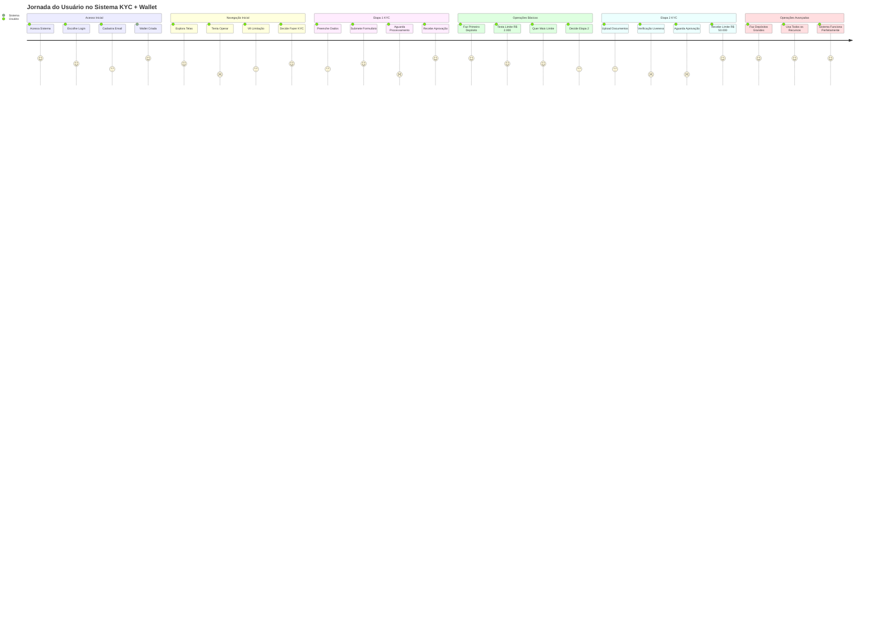
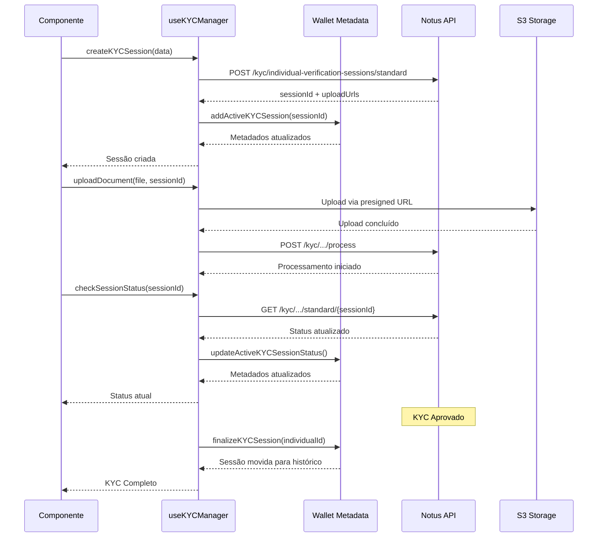
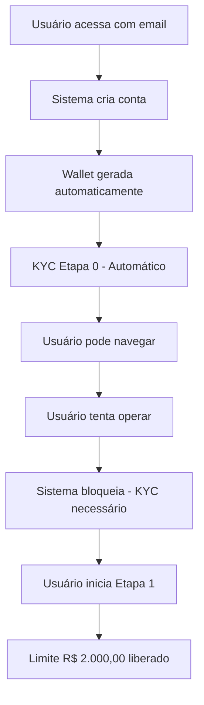
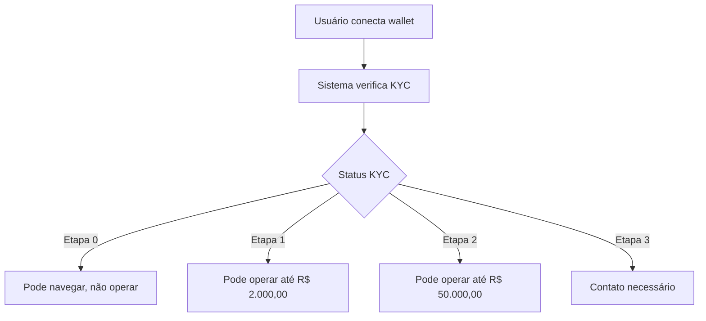
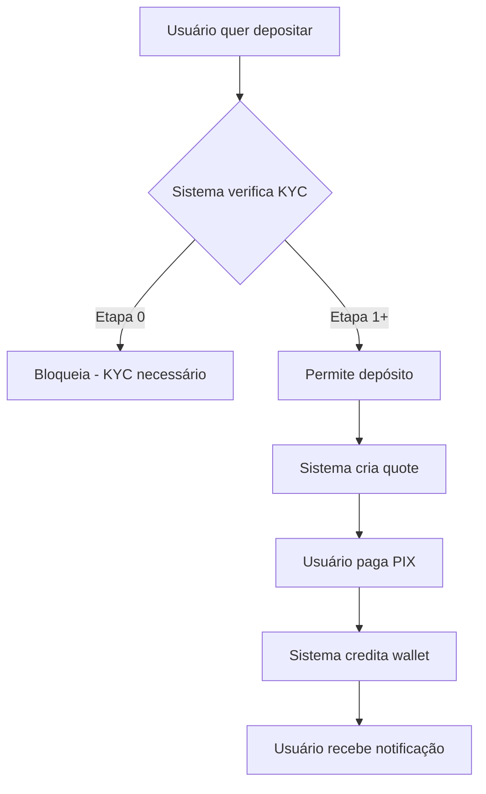

# 📊 Diagramas do Fluxo KYC + Wallet Integration

Este documento contém os diagramas Mermaid que ilustram o fluxo completo do sistema KYC integrado com wallets, desde o acesso do usuário até as operações de on-ramp.

## 🎯 Visão Geral do Sistema

### Fluxo Principal de Acesso e KYC



## 🔐 Fluxo Detalhado de KYC

### Etapas do KYC



## 💰 Fluxo de On-Ramp (Depósito Fiat)

### Processo Completo de Depósito



## 🔄 Fluxo de Off-Ramp (Saque Fiat)

### Processo Completo de Saque



## 🏗️ Arquitetura do Sistema

### Componentes e Integração



## 📱 Fluxo de Navegação do Usuário

### Jornada Completa do Usuário



## 🔧 Fluxo Técnico de Implementação

### Sessão KYC + Metadados da Wallet



## 🎯 Casos de Uso Principais

### 1. Usuário Novo (Email)



### 2. Usuário com Wallet Existente



### 3. Processo de On-Ramp Completo



## 📊 Estados e Transições

### Estados do KYC

```mermaid
stateDiagram-v2
    [*] --> Etapa0: Usuário cadastra email
    Etapa0 --> Etapa1: Preenche dados pessoais
    Etapa1 --> Etapa2: Upload documentos + liveness
    Etapa2 --> Etapa3: Contato manual necessário
    Etapa3 --> [*]: Limite personalizado
    
    Etapa0 --> Etapa0: Navegação livre
    Etapa1 --> Etapa1: Operações até R$ 2.000,00
    Etapa2 --> Etapa2: Operações até R$ 50.000,00
    Etapa3 --> Etapa3: Operações limitadas
    
    note right of Etapa0: Limite: R$ 0,00
    note right of Etapa1: Limite: R$ 2.000,00
    note right of Etapa2: Limite: R$ 50.000,00
    note right of Etapa3: Limite: Personalizado
```

## 🚀 Próximos Passos

### Implementação e Testes

1. **Testes de Integração**
   - Testar fluxo completo com API Notus
   - Validar upload de documentos
   - Verificar webhooks de notificação

2. **Implementação Frontend**
   - Integrar KYCManager nas telas principais
   - Implementar portfolio e histórico
   - Adicionar notificações em tempo real

3. **Testes de Usuário**
   - Testar jornada completa do usuário
   - Validar limites e restrições
   - Verificar experiência em diferentes dispositivos

---

**Última atualização:** 20/01/2025  
**Versão:** 1.0  
**Status:** Em desenvolvimento
