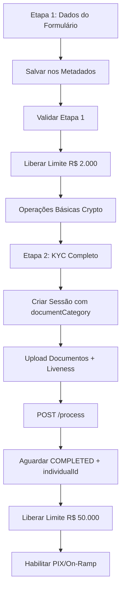

# Scripts KYC + Wallet Integration

Este diretório contém scripts que demonstram o fluxo correto de integração entre KYC e Wallet por etapas, seguindo as regulamentações bancárias.

## 📋 Scripts Disponíveis

### 1. `kyc-stage1-with-wallet-metadata.sh`
**Fluxo Etapa 1 - Dados do Formulário (Limite R$ 2.000)**

Demonstra o fluxo da Etapa 1:
1. ✅ Coleta dados do formulário (nome, CPF, endereço, etc.)
2. ✅ Salva dados nos metadados da wallet
3. ✅ Valida etapa 1 via metadados
4. ✅ Libera limite R$ 2.000 para operações básicas
5. ⚠️ NÃO cria sessão KYC ainda (sem documentCategory)

**Como executar:**
```bash
export NOTUS_API_KEY="sua_api_key_aqui"
./kyc-stage1-with-wallet-metadata.sh
```

### 2. `kyc-stage1-with-pix-deposit.sh`
**Fluxo Etapa 1 + Tentativa PIX (Negada)**

Demonstra o fluxo da Etapa 1 + tentativa de PIX:
1. ✅ Coleta dados do formulário
2. ✅ Salva dados nos metadados da wallet
3. ✅ Valida etapa 1 via metadados
4. ✅ Libera limite R$ 2.000 para operações básicas
5. ❌ Tenta gerar QR Code PIX (NEGADO - precisa KYC completo)

**Como executar:**
```bash
export NOTUS_API_KEY="sua_api_key_aqui"
./kyc-stage1-with-pix-deposit.sh
```

## 🔧 Configuração

### Variáveis de Ambiente
```bash
export NOTUS_API_KEY="eyJhbGciOiJIUzI1NiIsInR5cCI6IkpXVCJ9..."
```

### Dados de Teste
Os scripts usam dados de teste padrão:
- **Nome:** João Silva Santos
- **Email:** joao.silva@teste.com
- **Documento:** 12345678901
- **Wallet:** 0x742d35Cc6634C0532925a3b8D4C9db96C4b4d8b6

## 📊 Fluxo de Dados por Etapas



## 🎯 Resultados Esperados

### Script 1 - Etapa 1 (Dados do Formulário)
```
✅ Dados do formulário coletados
✅ Dados salvos na wallet
✅ Status: STAGE_1_COMPLETED
✅ Limite liberado: R$ 2.000,00
✅ Etapa 1 validada com sucesso
⚠️  SessionId: Não criado ainda (será criado na Etapa 2)
```

### Script 2 - Etapa 1 + PIX (Negado)
```
✅ Dados do formulário coletados
✅ Dados salvos na wallet
✅ Status: STAGE_1_COMPLETED
✅ Limite liberado: R$ 2.000,00
✅ Etapa 1 validada com sucesso
❌ PIX negado (KYC não completo)
❌ Individual ID: Não disponível
❌ Motivo: Precisa de KYC completo para PIX
```

## 🔍 Estrutura dos Metadados

Os scripts salvam os seguintes metadados na wallet:

### Etapa 1 - Dados do Formulário
```json
{
  "metadata": {
    "kycStatus": "STAGE_1_COMPLETED",
    "stage1FormData": {
      "firstName": "João",
      "lastName": "Silva Santos",
      "birthDate": "1990-03-15",
      "documentId": "12345678901",
      "nationality": "BRAZILIAN",
      "email": "joao.silva@teste.com",
      "address": "Rua das Flores, 123, Apto 45",
      "city": "São Paulo",
      "state": "SP",
      "postalCode": "01234-567",
      "completedAt": "2025-09-23T21:43:31.000Z"
    },
    "kycLimits": {
      "currentLimit": 2000.00,
      "maxLimit": 50000.00,
      "currency": "BRL",
      "stage": "1"
    },
    "activeKYCSession": null
  }
}
```

## 🚀 Próximos Passos

1. **Etapa 2 KYC:** Criar sessão KYC com documentCategory
2. **Upload Documentos:** Enviar documentos + liveness para S3
3. **Processamento:** Aguardar status COMPLETED + individualId
4. **Operações Fiat:** Habilitar PIX/On-Ramp com limite R$ 50.000
5. **Webhooks:** Implementar notificações em tempo real

## 📝 Notas Importantes

- ⚠️ **API Metadata:** A API Notus espera metadados como strings, não objetos JSON
- ⚠️ **Wallet Query:** Para consultar wallet real, precisa do EOA e factory
- ⚠️ **PIX Requirements:** PIX precisa de KYC completo (COMPLETED + individualId)
- ✅ **Etapa 1:** Funciona perfeitamente para operações básicas até R$ 2.000
- ✅ **Regulamentações:** PIX segue regulamentações bancárias (Transfero reporta à Receita)

## 🛠️ Troubleshooting

### Erro: "Expected string, received object"
- **Causa:** API Notus espera metadados como strings
- **Solução:** Converter objetos JSON para strings antes de enviar

### Erro: "externallyOwnedAccount required"
- **Causa:** Consulta de wallet precisa do EOA e factory
- **Solução:** Usar dados reais ou simular resposta

### PIX Negado
- **Causa:** KYC não está completo (precisa de COMPLETED + individualId)
- **Solução:** Executar Etapa 2 (upload documentos + liveness)

### Limite R$ 2.000 vs R$ 50.000
- **R$ 2.000:** Etapa 1 (apenas dados do formulário) - operações básicas
- **R$ 50.000:** Etapa 2 (KYC completo) - operações PIX/On-Ramp
